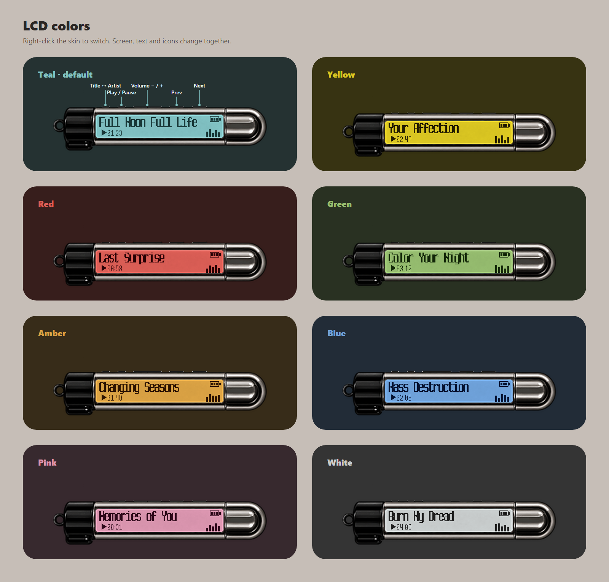
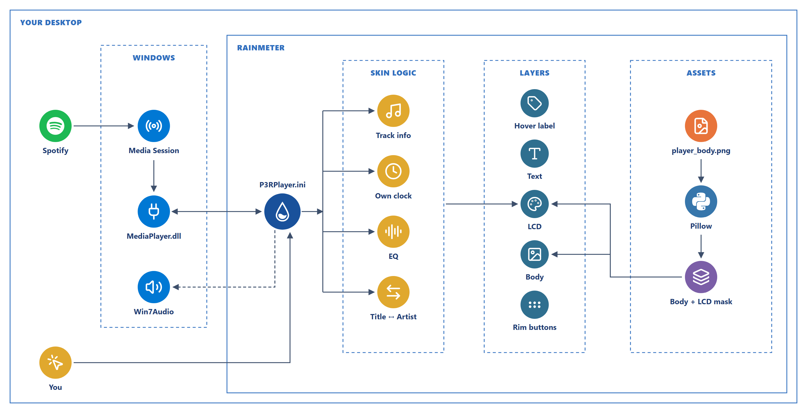

<div align="center">

# P3R Rainmeter Player

A Persona 3 Reload-inspired Spotify mini player for Rainmeter.


<p>
  
  
  
</p>

</div>

A lightweight desktop music player skin inspired by the portable music player UI from **Persona 3 Reload**.

It displays your current Spotify track, elapsed playback time, and provides basic media controls directly from your desktop.

## Features

- Spotify track title or artist display
- Elapsed playback time that ticks steadily once per second
- Rim buttons modeled on the original Walkman: info, play / pause, volume, previous, next
- Button name labels on hover
- 8 LCD color presets, switched from the right-click menu
- Equalizer bars that move while music is playing
- Persona 3 Reload-inspired LCD design
- Transparent desktop widget
- Always-on-top support
- Click-through support

## LCD Colors

<div align="center">
  
</div>

Right-click the skin and pick an **LCD:** entry. The screen, text and icons change together, and the choice is kept after a restart.

To use your own colors, edit these two lines in `P3RPlayer.ini` and refresh the skin:

```ini
; Screen color (shows about 14% darker than the value)
LCDColor=150,225,227
; Text and icon color
LCDText=24,55,55,255
```

## Requirements

Before installing the skin, install the following:

### Rainmeter

Download and install Rainmeter:

https://www.rainmeter.net/

### RainmeterMediaPlayer

This skin uses `MediaPlayer.dll` to read Spotify playback information.

Download the latest release:

https://github.com/i2002/RainmeterMediaPlayer/releases

Download the `.rmskin` file, open it, and click **Install**.

### Long Pixel-7

The LCD text uses the **Long Pixel-7** font.

Download it here:

https://font.download/font/long-pixel-7

After downloading:

1. Extract the ZIP file.
2. Find the `.ttf` font file.
3. Right-click the font file.
4. Select **Install**.

### Spotify Desktop

Spotify Desktop must be running for playback information to appear.

https://www.spotify.com/download/windows/

## Installation

1. Click **Code → Download ZIP** on this repository.

2. Extract the ZIP file.

3. Rename the extracted folder to:

```text
P3RPlayer
```

4. Move the folder to:

```text
Documents\Rainmeter\Skins\
```

The final folder structure should look like this:

```text
P3RPlayer
├── P3RPlayer.ini
└── @Resources
    └── Images
        ├── player_body.png
        ├── player_body_300.png
        └── lcd_screen.png
```

5. Open Rainmeter.

6. Click **Refresh all**.

7. Load:

```text
P3RPlayer → P3RPlayer.ini
```

Start playing a song in Spotify and the player should update automatically.

## Recommended Settings

To keep the player visible above other windows:

```text
Right-click the skin
→ Settings
→ Position
→ Stay Topmost
```

To allow mouse clicks to pass through the widget:

```text
Right-click the skin
→ Settings
→ Click through
```

> [!NOTE]
> With **Click through** enabled, the player's buttons cannot be clicked.
> Leave it off if you want to control playback from the widget.

## Controls

The buttons on the top rim, from left to right:

| Button | Action |
|---|---|
| INFO | Show the track title or the artist |
| PLAY | Play / Pause |
| VOL − / + | Windows volume down / up (5%) |
| PREV | Previous track |
| NEXT | Next track |

Hover over a button to see its name. The black cap on the left also has hidden Previous / Play / Next areas.

Right-click the skin to change the LCD color.

Spotify must be running for the playback controls to work.
The buttons do not respond while **Click through** is enabled.

## How it works

<div align="center">
  
</div>

- **Playback data:** Spotify publishes its state to the Windows media session. `MediaPlayer.dll` reads it, and the skin polls it.
- **Elapsed time:** the plugin rounds song position and wall time to whole seconds separately, so its counter skips or stalls. The skin counts on the system clock instead and resyncs only on pause, seek or track change.
- **Rim buttons:** drawn behind the body image, so only their top edge shows, like the Sony Walkman the in-game player is based on.
- **LCD colors:** the LCD is cut out of the artwork as a grey mask (`lcd_screen.png`) and tinted at runtime, so one image covers every color.

## Troubleshooting

### No player active

Make sure:

- Spotify Desktop is running
- A song is currently playing
- RainmeterMediaPlayer is installed

If necessary, restart Rainmeter after installing RainmeterMediaPlayer.

### The font looks different

Make sure **Long Pixel-7** is installed, then refresh the skin.

### The player disappears behind other windows

Enable:

```text
Settings
→ Position
→ Stay Topmost
```

### The buttons do not respond

Make sure **Click through** is disabled:

```text
Right-click the skin
→ Settings
→ Click through
```

## Credits

- [Rainmeter](https://www.rainmeter.net/)
- [RainmeterMediaPlayer](https://github.com/i2002/RainmeterMediaPlayer)
- [Long Pixel-7](https://font.download/font/long-pixel-7)
- Diagram icons: [Lucide](https://lucide.dev), [Simple Icons](https://simpleicons.org)

## Disclaimer

This is an unofficial fan-made Rainmeter skin inspired by **Persona 3 Reload**.

Persona 3 Reload and related trademarks and intellectual property belong to **ATLUS / SEGA** and their respective owners.

This project is not affiliated with or endorsed by ATLUS or SEGA.

Feedback, bug reports, and suggestions are always welcome. Feel free to open an issue or leave a comment.

If you like the skin, consider leaving a ⭐ on the repository.
