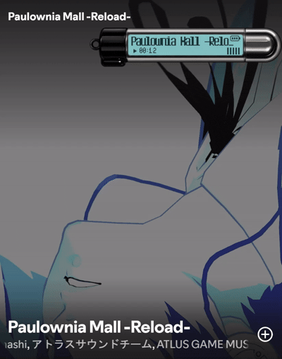

<div align="center">

# P3R Rainmeter Player

A Persona 3 Reload-inspired Spotify mini player for Rainmeter.



<p>
  
  
  
</p>

</div>

A lightweight desktop music player skin inspired by the portable music player UI from **Persona 3 Reload**.

It displays your current Spotify track, elapsed playback time, and provides basic media controls directly from your desktop.

## Features

- Spotify track title display
- Elapsed playback time
- Play / Pause / Previous / Next controls
- Persona 3 Reload-inspired LCD design
- Transparent desktop widget
- Always-on-top support
- Click-through support

## Requirements

Before installing the skin, install the following:

### Rainmeter

Download and install Rainmeter:

https://www.rainmeter.net/

### RainmeterMediaPlayer

This skin uses `MediaPlayer.dll` to read Spotify playback information.

Download the latest release:

https://github.com/i2002/RainmeterMediaPlayer/releases

Download the `.rmskin` file, open it, and click **Install**.

### Long Pixel-7

The LCD text uses the **Long Pixel-7** font.

Download it here:

https://font.download/font/long-pixel-7

After downloading:

1. Extract the ZIP file.
2. Find the `.ttf` font file.
3. Right-click the font file.
4. Select **Install**.

### Spotify Desktop

Spotify Desktop must be running for playback information to appear.

https://www.spotify.com/download/windows/

## Installation

1. Click **Code → Download ZIP** on this repository.

2. Extract the ZIP file.

3. Rename the extracted folder to:

```text
P3RPlayer
```

4. Move the folder to:

```text
Documents\Rainmeter\Skins\
```

The final folder structure should look like this:

```text
P3RPlayer
├── P3RPlayer.ini
└── @Resources
    └── Images
        └── player_body.png
```

5. Open Rainmeter.

6. Click **Refresh all**.

7. Load:

```text
P3RPlayer → P3RPlayer.ini
```

Start playing a song in Spotify and the player should update automatically.

## Recommended Settings

To keep the player visible above other windows:

```text
Right-click the skin
→ Settings
→ Position
→ Stay Topmost
```

To allow mouse clicks to pass through the widget:

```text
Right-click the skin
→ Settings
→ Click through
```

## Controls

The left side of the player contains invisible clickable areas for:

- Previous track
- Play / Pause
- Next track

Spotify must be running for the controls to work.

## Troubleshooting

### No player active

Make sure:

- Spotify Desktop is running
- A song is currently playing
- RainmeterMediaPlayer is installed

If necessary, restart Rainmeter after installing RainmeterMediaPlayer.

### The font looks different

Make sure **Long Pixel-7** is installed, then refresh the skin.

### The player disappears behind other windows

Enable:

```text
Settings
→ Position
→ Stay Topmost
```

## Credits

- [Rainmeter](https://www.rainmeter.net/)
- [RainmeterMediaPlayer](https://github.com/i2002/RainmeterMediaPlayer)
- [Long Pixel-7](https://font.download/font/long-pixel-7)

## Disclaimer

This is an unofficial fan-made Rainmeter skin inspired by **Persona 3 Reload**.

Persona 3 Reload and related trademarks and intellectual property belong to **ATLUS / SEGA** and their respective owners.

This project is not affiliated with or endorsed by ATLUS or SEGA.

<div align="center">

If you like the skin, consider leaving a ⭐ on the repository.

</div>
